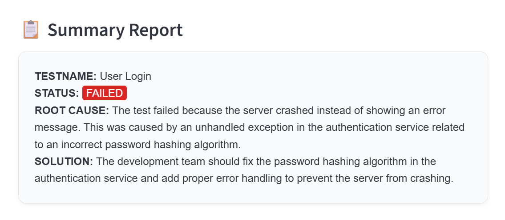

# AI Log Analyzer

A Streamlit-based web application that uses Google's Gemini AI to analyze test log files and provide intelligent summaries of test failures, root causes, and suggested solutions.

## Features

- **AI-Powered Analysis**: Uses Google Gemini 2.5 Pro to analyze log files
- **Intelligent Summarization**: Extracts key information including test name, device, status, root cause, and solutions
- **User-Friendly Interface**: Clean, intuitive Streamlit web interface
- **Visual Status Indicators**: Color-coded status badges (PASS/FAIL)


## Quick Start

### Prerequisites

- Python 3.7 or higher
- Google Gemini API key

### Installation

1. **Clone the repository**
   ```bash
   git clone <>
   cd LogAnalyzerAI
   ```

2. **Install dependencies**
   ```bash
   pip install -r requirements.txt
   ```

3. **Set up your API key**
   
   You need to obtain a Google Gemini API key and set it as an environment variable.
   
   **Option 1: Environment Variable (Recommended)**
   ```bash
   export GEMINI_API_KEY="your_api_key_here"
   ```
   
   **Option 2: Add to your shell profile**
   ```bash
   echo 'export GEMINI_API_KEY="your_api_key_here"' >> ~/.bashrc
   source ~/.bashrc
   ```

### How to Get Google Gemini API Key

1. Go to [Google AI Studio](https://aistudio.google.com/)
2. Sign in with your Google account
3. Click on "Get API Key" 
4. Create a new API key
5. Copy the generated API key

## How to Run

1. **Start the application**
   ```bash
   streamlit run logAnalyzer.py
   ```

2. **Access the web interface**
   - The application will automatically open in your default browser
   - If not, navigate to `http://localhost:8501`

3. **Upload and analyze logs**
   - Click "Choose a test log file" 
   - Select a `.txt` log file
   - Wait for AI analysis
   - View the formatted summary report

## Configuration

### LLM Configuration

The application is configured to use **Google Gemini 2.5 Pro** model. Key configuration parameters:

- **Model**: `gemini-2.5-pro`
- **API Key**: Set via `GEMINI_API_KEY` environment variable
- **Input**: Text files (`.txt` format)
- **Output Format**: Structured summary with predefined fields

### Customizing the Analysis Prompt

You can modify the analysis prompt in `logAnalyzer.py` around line 25. The current prompt structure extracts:

- **TESTNAME**: Name of the test
- **DEVICE**: Device information  
- **STATUS**: Test status (PASS/FAIL)
- **ROOT CAUSE**: Why the test failed (max 2 sentences)
- **SOLUTION**: Suggested fix or next steps

## Output Format

The AI analyzer provides structured output in the following format:

```
TESTNAME: Example Test Name
DEVICE: Test Device Model
STATUS: FAILED
ROOT CAUSE: Brief explanation of why the test failed
SOLUTION: Suggested resolution steps
```

## Dependencies

- **streamlit**: Web application framework
- **google-generativeai**: Google Gemini AI integration
- **os**: Environment variable handling (built-in)
- **re**: Regular expressions for text formatting (built-in)

## Troubleshooting

### Common Issues

1. **API Key Error**
   ```
   ⚠️ GEMINI_API_KEY not found in environment variables.
   ```
   **Solution**: Ensure your API key is properly set as an environment variable

2. **File Upload Issues**
   - Only `.txt` files are supported
   - Ensure your log file is in plain text format
   - The app does not support huge log files

3. **Model Connection Issues**
   - Check your internet connection
   - Verify your API key is valid and has quota remaining

### Debug Mode

To run in debug mode with verbose output:
```bash
streamlit run logAnalyzer.py --logger.level=debug
```


## Contributing

Contributions are welcome! Please open an issue or submit a pull request if you have suggestions or improvements.
## License

This project is licensed under the MIT License

## Future Enhancements

- [ ] Support for multiple log file formats (CSV, JSON, XML)
- [ ] Support huge log files
- [ ] Batch processing of multiple log files
- [ ] Export analysis results to PDF/Excel
- [ ] Custom prompt templates
- [ ] Integration with other LLM providers
- [ ] Historical analysis tracking
- [ ] Advanced filtering and search capabilities

---
